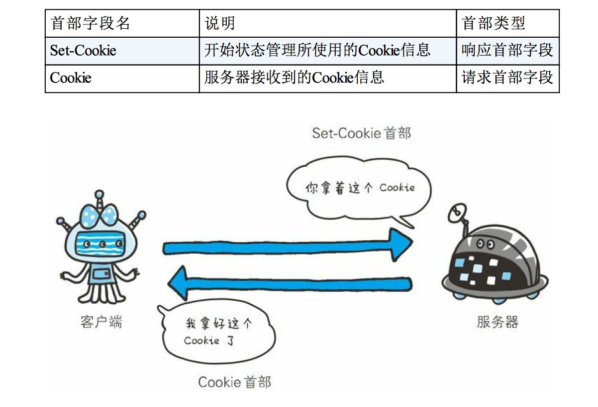
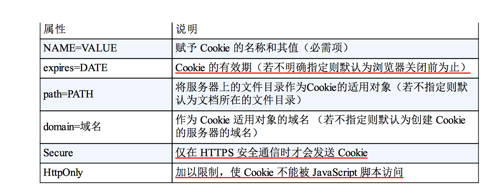
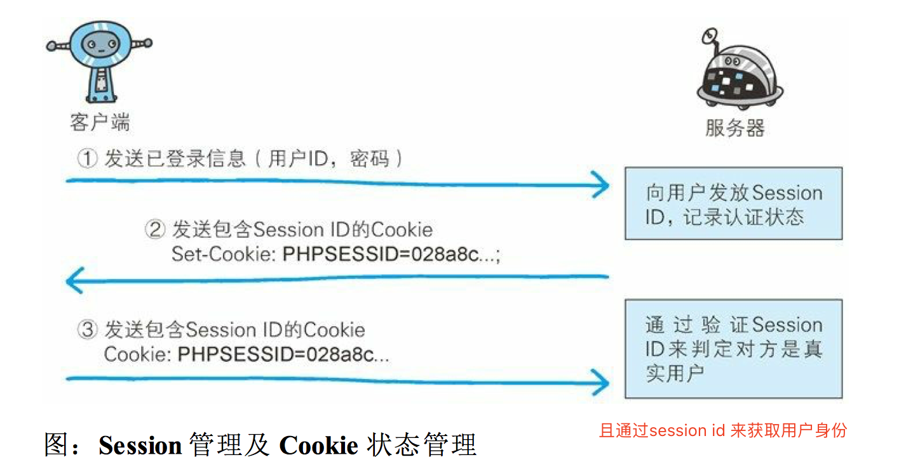

## cookie

cookie是指Web浏览器存储的少址数据

####  浏览器使用

cookie可以使用 js 在浏览器直接设置（用于记录不敏感信息，如用户名）

大小和数量会有限制

如果没有设置有效期，那就是会话储存，关了浏览器就没了。

尽管浏览器对cookie做了大小限制，不过最好还是尽可能在coki中少存储信息，以免避免影响性能。

#### 前后端协同使用

cookie数据会自动在Web浏览器和Web服务器之间传输，在服务端通使用 HTTP 协议规定的 set-cookie 来让浏览器种下cookie，每次网络请求 Request headers 中都会带上cookie。所以如果 cookie 太多太大对传输效率会有影响。

因此服务端脚本就可以 读、 写存储在客户端的 cookie的值。

* 前后端协同使用

* Response headers

> Set-Cookie 字段的属性

* Request headers

## session

session 是一种基于cookie的让服务器能识别某个用户的「机制」，当然也可以特指服务器存储的 session数据。

> 用一个购物过程来理解

当一个用户打开淘宝登录后，刷新浏览器仍然展示登录状态。然后把购物车的东西下单支付了。

刷新的时候服务器如何分辨这次发起请求的用户是刚才登录过的用户呢？下单的时候又怎么知道是哪个用户下单的呢？

> 鉴于 HTTP 是无状态协议，之前已认证成功的用户状态无法通过协 议层面保存下来。即，无法实现状态管理，因此即使当该用户下一次 继续访问，也无法区分他与其他的用户。

于是我们会使用 Cookie 来 管理 Session，以弥补 HTTP 协议中不存在的状态管理功能。

1.用户在输入用户名密码提交给服务端，服务端验证通过后会创建一个session用于记录用户的相关信息的对象，这个session对象中放有生成的sessionid，也可以放一些非机密的userinfo。session对象可保存在服务器内存中（容易产生内存泄露），生产环境一般是保存在数据库中。

 上图为使用koa-session-minimal 后存在数据库的session store

2.创建session后，会把关联的session_id 通过setCookie 添加到http响应头部中。
浏览器在加载页面时发现响应头部有 set-cookie字段，就把这个cookie 种到浏览器指定域名下

3.客户端接收到从服务器端发来的 Session ID 后，会将其作为 Cookie 保存在本地。之后你发起刷新或者下单的请求时，浏览器会自动发送被种下sessionid的cookie，后端接受后去存session的地方根据sessionid查找是否有此session（有既证明处于登录状态的真实用户，否则拒绝此次请求），如果有，还可以读取登录时放的userinfo，获取用户身份（user_id）。

需要注意的是，如果 Session ID 被第三方盗走，对方就可以伪装成你的身份进 行恶意操作了。因此必须防止 Session ID 被盗，或被猜出。为了做到 这点，Session ID 应使用难以推测的字符串，且服务器端也需要进行 有效期的管理（即使不幸被盗，之后也因有效期已过而失效），保证其安全性。

另外，为减轻跨站脚本攻击（XSS）造成的损失，建议事先在 Cookie 内加上 httponly 属性。
